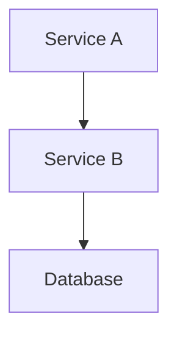

# Docgen

A personal document generation tool built for [Claude Code](https://claude.ai/claude-code). Scaffold technical specifications, proposals, statements of work, and architecture documents from templates, interactively fill them with Claude, and export professional PDFs with diagrams.

## Features

- **4 document types**: Tech specs, proposals, SOWs, architecture docs
- **Jinja2 templates** with YAML frontmatter for metadata and section flags
- **Mermaid diagrams** rendered inline to PNG/SVG via `mmdc`
- **Draw.io diagrams** exported via draw.io CLI (supports AWS, GCP, Azure icon packs)
- **PDF export** via Pandoc + WeasyPrint with CSS Paged Media (cover pages, TOC, page numbers, headers/footers)
- **Gantt chart helpers** for timeline generation
- **Claude Code slash commands** for interactive document creation
- **Layered config**: global defaults with per-project overrides

## Setup

### Prerequisites

- **Python 3.11+**
- **Node.js** (for mermaid-cli)
- **Homebrew** (macOS)
- **Pandoc 3.x** — `brew install pandoc`

### Install

```bash
# Clone the repo (choose any location you prefer)
git clone https://github.com/renztegrado/docgen.git
cd docgen

# System dependencies
brew install pandoc                          # macOS
brew install --cask drawio                   # macOS (Linux: snap install drawio)
npm install -g @mermaid-js/mermaid-cli

# Python virtual environment
python3 -m venv .venv
source .venv/bin/activate
pip install Jinja2 PyYAML python-frontmatter WeasyPrint Pygments
```

### Slash commands

Slash commands live in `.claude/commands/` and are automatically available when you run Claude Code from the docgen directory. No install step needed — just `cd` into the project and use `/new-tech-spec`, `/export-pdf`, etc.

### Verify installation

```bash
source .venv/bin/activate
python -m docgen.init_project "test-project" tech-spec
python -m docgen.export projects/test-project/docs/test-project-tech-spec.md
open projects/test-project/output/test-project-tech-spec.pdf
rm -rf projects/test-project
```

## Usage

### With Claude Code (slash commands)

The primary interface is through Claude Code slash commands:

| Command | Purpose |
|---------|---------|
| `/new-tech-spec <project>` | Scaffold + interactively fill a technical specification |
| `/new-proposal <project>` | Scaffold + interactively fill a project proposal |
| `/new-sow <project>` | Scaffold + interactively fill a statement of work |
| `/new-architecture <project>` | Scaffold + interactively fill an architecture document |
| `/new-gantt <project>` | Create a gantt chart (high-level or detailed) |
| `/export-pdf <doc-path>` | Export markdown document to PDF |
| `/export-diagrams <doc-path>` | Export all diagrams as standalone PNG/SVG |

Each creation command scaffolds a project, then Claude walks you through section-by-section Q&A to fill the document with real content.

### CLI (without Claude Code)

```bash
source .venv/bin/activate

# Scaffold a new project
python -m docgen.init_project "api-redesign" tech-spec

# Scaffold with a custom title
python -m docgen.init_project "api-redesign" tech-spec "API Gateway Redesign"

# Export to PDF
python -m docgen.export projects/api-redesign/docs/api-redesign-tech-spec.md

# Export diagrams only
python -m docgen.diagrams projects/api-redesign/docs/api-redesign-tech-spec.md

# Generate a gantt chart
python -m docgen.gantt
```

## Configuration

### Global config (`docgen.config.json`)

Defaults applied to all new documents:

```json
{
  "author": "Your Name",
  "company": "Your Company",
  "email": "you@example.com",
  "default_paper_size": "A4",
  "default_margin": "2cm",
  "accent_color": "#2563eb",
  "font_family": "Inter, system-ui, sans-serif",
  "default_export_format": "png",
  "mermaid_theme": "default"
}
```

### Per-project config (`projects/<name>/docgen.config.json`)

Create a `docgen.config.json` inside any project folder to override global defaults for that project. Only include the keys you want to override:

```json
{
  "author": "Different Author",
  "accent_color": "#dc2626"
}
```

Project config values take precedence over global config. Non-overridden keys fall through from global.

## Project Structure

Each document lives in its own project folder:

```
projects/<project-name>/
├── docgen.config.json     # Optional per-project config overrides
├── docs/
│   └── <project>-<type>.md
├── diagrams/
│   ├── *.drawio
│   └── exports/           # Rendered PNG/SVG
├── output/
│   └── *.pdf
└── assets/
```

## Document Types

### Tech Spec (`tech-spec`)
Full technical specification with goals/non-goals, technical design, API design, data model, implementation plan, risk assessment, testing strategy, and rollout plan.

### Proposal (`proposal`)
Project proposal with problem statement, proposed solution, deliverables, timeline, budget, and acceptance criteria.

### SOW (`sow`)
Statement of work with parties, scope, deliverables, work breakdown, pricing, payment terms, acceptance process, and legal terms.

### Architecture (`architecture`)
Architecture document with C4 diagrams (context, container, component), data architecture, infrastructure, cross-cutting concerns, and architecture decision records (ADRs).

## Diagrams

### Mermaid

Add mermaid code blocks directly in your markdown:

````markdown

````

During PDF export, mermaid blocks are automatically rendered to PNG and embedded.

### Draw.io

1. Create `.drawio` files in `projects/<name>/diagrams/`
2. List them in the document's YAML frontmatter:

```yaml
diagrams:
  drawio_files:
    - architecture.drawio
    - data-flow.drawio
```

3. On export, draw.io files are rendered to PNG/SVG in `diagrams/exports/`

Draw.io supports the full AWS, GCP, and Azure icon libraries — use dedicated shape names (e.g., `mxgraph.aws4.application_load_balancer`) for reliable CLI export.

## Customizing Styles

PDF styling uses CSS Paged Media via WeasyPrint. Edit the files in `styles/`:

| File | Controls |
|------|----------|
| `base.css` | Typography, page geometry, @page rules, headers/footers |
| `cover.css` | Cover page layout |
| `toc.css` | Table of contents |
| `code.css` | Code blocks + syntax highlighting |
| `tables.css` | Table styling |
| `print.css` | Master import (combines all above) |

## Export Pipeline

```
Source .md
  → Parse YAML frontmatter
  → Render mermaid blocks to PNG/SVG (mmdc)
  → Render draw.io files to PNG/SVG (draw.io CLI)
  → Pandoc + WeasyPrint + CSS
  → PDF
```

## License

MIT
