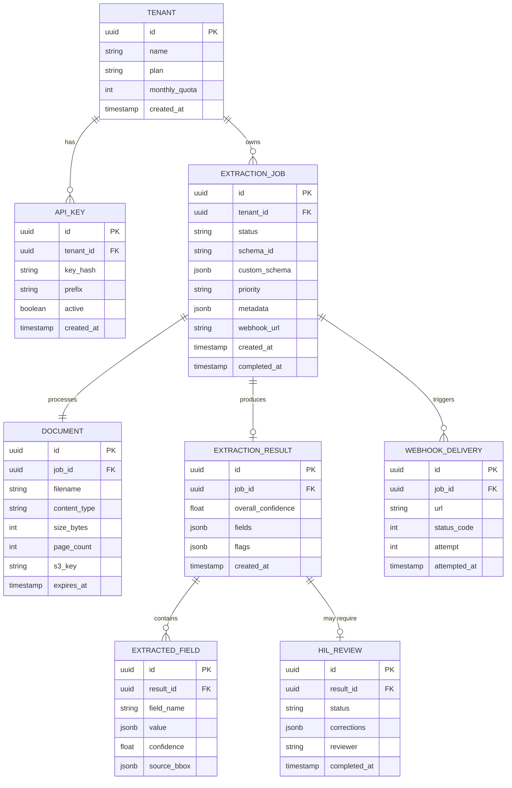
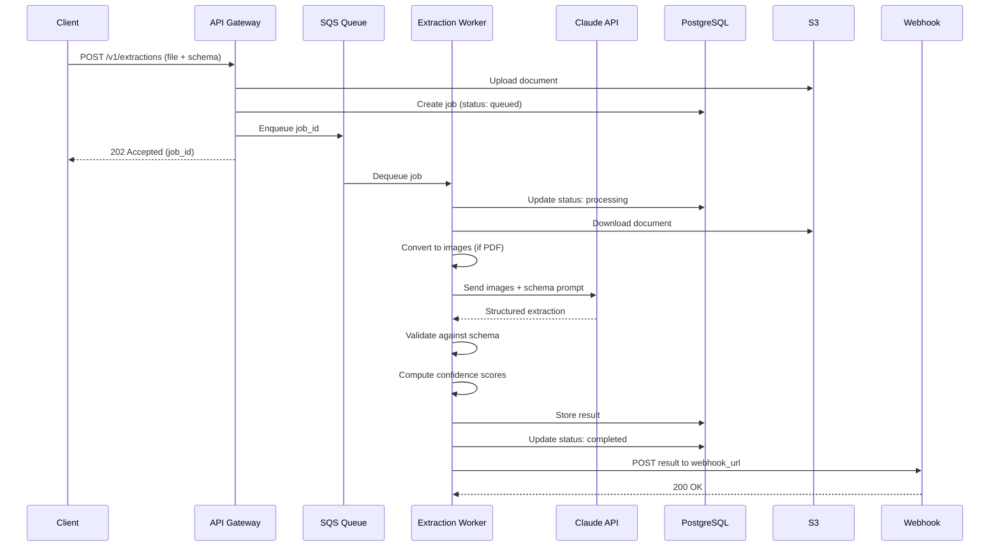
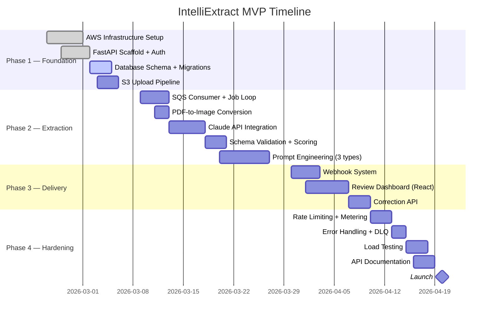

::: {.cover-page}

# IntelliExtract AI

## Technical Specification — MVP

**Author:** Renz Tegrado

**Date:** 2026-02-19 | **Version:** 0.1.0 | **Status:** Draft

:::

<!-- TOC is auto-generated by Pandoc with --toc flag -->

## Revision History

| Version | Date | Author | Description |
|---------|------|--------|-------------|
| 0.1.0 | 2026-02-19 | Renz Tegrado | Initial draft |

## Executive Summary

IntelliExtract is a B2B API platform that uses large language models and vision models to extract structured data from unstructured business documents — invoices, contracts, purchase orders, compliance forms, and insurance claims.

Enterprises currently spend 60–80% of back-office processing time on manual data entry from documents that arrive in inconsistent formats (PDF, scanned images, email attachments). Existing OCR solutions require rigid template configuration per document type and fail on layout variations.

IntelliExtract solves this with a **schema-driven extraction API**: clients define the data schema they need (e.g., "vendor name, line items, total amount, due date"), upload a document, and receive structured JSON back — no template configuration, no training data, no per-format setup.

**MVP scope**: REST API with async processing, support for PDF and image inputs, three core document types (invoices, purchase orders, contracts), a webhook-based delivery system, and a lightweight review dashboard for human-in-the-loop validation.

## 1. Introduction

### 1.1 Purpose

This technical specification defines the architecture, API contracts, data model, and implementation plan for the IntelliExtract MVP. It serves as the single source of truth for engineering decisions and is intended for the founding engineering team.

### 1.2 Scope

**In scope (MVP):**

- Document ingestion API (PDF, PNG, JPG, TIFF)
- Schema-driven extraction for invoices, purchase orders, and contracts
- Async processing pipeline with webhook delivery
- Confidence scoring per extracted field
- Human-in-the-loop review dashboard (read-only corrections)
- Multi-tenant API key authentication
- Usage metering and rate limiting

**Out of scope (post-MVP):**

- Real-time / synchronous extraction
- Custom model fine-tuning per tenant
- Document classification (auto-detect type)
- Email ingestion and watch folders
- SOC 2 compliance (planned for v1.1)
- On-premise deployment

### 1.3 Definitions & Acronyms

| Term | Definition |
|------|-----------|
| LLM | Large Language Model |
| VLM | Vision-Language Model (e.g., Claude with vision) |
| HIL | Human-in-the-loop — manual review step |
| Schema | JSON Schema defining expected extraction fields |
| Extraction Job | A single document processing request |

## 2. Background & Context

Enterprise document processing is a $12B market growing at 23% CAGR. Current solutions fall into two categories:

1. **Template-based OCR** (ABBYY, Kofax): High accuracy on trained templates but requires weeks of setup per document format. Breaks on layout changes.
2. **General-purpose AI extraction** (AWS Textract, Google Document AI): Better flexibility but returns raw text/key-value pairs without business-level schema understanding. Requires significant post-processing.

IntelliExtract occupies a new category: **schema-aware AI extraction**. Clients describe *what* they want extracted using a simple JSON schema, and the system figures out *how* to extract it from any document layout. This eliminates template configuration while delivering business-ready structured data.

**Key insight**: LLMs with vision capabilities can understand document layouts, tables, and relationships between fields in a way that traditional OCR cannot. By combining VLM extraction with schema validation and confidence scoring, we can deliver production-grade accuracy without per-format training.

## 3. Goals & Non-Goals

### Goals

1. **Sub-60-second extraction** for single-page documents (p95 latency)
2. **>92% field-level accuracy** on supported document types without any per-tenant training
3. **Zero-configuration onboarding**: first API call within 5 minutes of signup
4. **Schema flexibility**: support arbitrary extraction schemas beyond the three built-in types
5. **Production reliability**: 99.9% API uptime, exactly-once webhook delivery

### Non-Goals

1. We will **not** build a full document management system — IntelliExtract is an extraction API, not a DMS
2. We will **not** support real-time extraction in the MVP — all processing is async
3. We will **not** fine-tune models per tenant — the MVP uses a single model with prompt engineering
4. We will **not** handle document storage long-term — documents are deleted after 7 days

## 4. Technical Design

### 4.1 System Overview

IntelliExtract is a cloud-native async processing platform built on AWS. Documents flow through an ingestion API, are queued for processing, extracted by a VLM pipeline, validated against the client's schema, and delivered via webhook.

The system architecture diagram below shows the full request lifecycle:


### 4.2 API Design

#### Create Extraction Job

```
POST /v1/extractions
Content-Type: multipart/form-data
Authorization: Bearer {api_key}
```

**Request body:**

| Field | Type | Required | Description |
|-------|------|----------|-------------|
| `file` | binary | Yes | Document file (PDF, PNG, JPG, TIFF) |
| `schema_id` | string | No | Built-in schema: `invoice`, `purchase_order`, `contract` |
| `custom_schema` | object | No | Custom JSON Schema for extraction |
| `webhook_url` | string | Yes | URL to receive extraction results |
| `priority` | string | No | `standard` (default) or `express` |
| `metadata` | object | No | Arbitrary key-value pairs returned with results |

**Response (202 Accepted):**

```json
{
  "id": "ext_a1b2c3d4e5",
  "status": "queued",
  "created_at": "2026-02-19T10:30:00Z",
  "estimated_completion": "2026-02-19T10:31:00Z",
  "document": {
    "filename": "invoice-2024-001.pdf",
    "pages": 2,
    "size_bytes": 245000
  }
}
```

#### Get Extraction Status

```
GET /v1/extractions/{id}
Authorization: Bearer {api_key}
```

**Response (200 OK):**

```json
{
  "id": "ext_a1b2c3d4e5",
  "status": "completed",
  "result": {
    "schema_id": "invoice",
    "confidence": 0.96,
    "fields": {
      "vendor_name": {
        "value": "Acme Corp",
        "confidence": 0.99,
        "source": { "page": 1, "bbox": [45, 120, 200, 140] }
      },
      "invoice_number": {
        "value": "INV-2024-001",
        "confidence": 0.98,
        "source": { "page": 1, "bbox": [400, 120, 550, 140] }
      },
      "total_amount": {
        "value": 15750.00,
        "confidence": 0.94,
        "source": { "page": 2, "bbox": [400, 680, 550, 700] }
      },
      "line_items": [
        {
          "description": "Consulting Services - January 2024",
          "quantity": 1,
          "unit_price": 12500.00,
          "amount": 12500.00,
          "confidence": 0.95
        },
        {
          "description": "Travel Expenses",
          "quantity": 1,
          "unit_price": 3250.00,
          "amount": 3250.00,
          "confidence": 0.91
        }
      ]
    },
    "flags": [],
    "review_url": "https://app.intelliextract.ai/review/ext_a1b2c3d4e5"
  }
}
```

#### Webhook Delivery

```
POST {webhook_url}
Content-Type: application/json
X-IntelliExtract-Signature: sha256=...
```

Webhook payloads use the same schema as the GET response. Failed deliveries are retried with exponential backoff (3 attempts over 1 hour).

### 4.3 Data Model



### 4.4 Key Design Decisions

| Decision | Options Considered | Choice | Rationale |
|----------|-------------------|--------|-----------|
| **LLM provider** | OpenAI GPT-4o, Anthropic Claude, Google Gemini | Anthropic Claude (Sonnet) | Best vision extraction accuracy in benchmarks; predictable pricing; strong structured output support |
| **Processing model** | Synchronous, async with polling, async with webhooks | Async + webhooks | Documents take 10–60s to process; webhooks avoid polling overhead for clients |
| **Queue system** | SQS, RabbitMQ, Redis Streams | Amazon SQS | Managed service, exactly-once processing, native DLQ support, priority via separate queues |
| **Database** | PostgreSQL, DynamoDB, MongoDB | PostgreSQL (RDS) | Relational model fits multi-tenant extraction data; JSONB for flexible schema storage |
| **Document storage** | S3, EFS, local disk | S3 with lifecycle policy | Automatic 7-day expiration; pre-signed URLs for secure access; cost-effective |
| **API framework** | FastAPI, Django, Express | FastAPI | Native async, auto OpenAPI docs, Pydantic validation, Python ecosystem for ML integration |

### 4.5 Processing Pipeline



## 5. Implementation Plan

### 5.1 Phases

**Phase 1 — Foundation (Weeks 1–2)**

- AWS infrastructure setup (VPC, RDS, SQS, S3, ECS)
- FastAPI project scaffold with auth middleware
- PostgreSQL schema migration (Alembic)
- Document upload to S3 with pre-signed URLs
- Basic API key authentication

**Phase 2 — Extraction Pipeline (Weeks 3–5)**

- SQS consumer with job processing loop
- PDF-to-image conversion (pdf2image/Poppler)
- Claude API integration with structured prompts
- Schema validation and confidence scoring
- Invoice extraction prompt engineering and testing
- Purchase order and contract extraction prompts

**Phase 3 — Delivery & Dashboard (Weeks 6–7)**

- Webhook delivery with retry logic
- Human-in-the-loop review dashboard (React)
- Extraction result viewer with field highlighting
- Correction submission API

**Phase 4 — Production Hardening (Week 8)**

- Rate limiting (token bucket per tenant)
- Usage metering and quota enforcement
- Error handling, DLQ processing, alerting
- Load testing (target: 100 concurrent extractions)
- API documentation (OpenAPI + guides)

### 5.2 Timeline



### 5.3 Dependencies

| Dependency | Type | Risk | Mitigation |
|-----------|------|------|------------|
| Anthropic Claude API | External service | API rate limits, pricing changes | Implement provider abstraction layer; negotiate enterprise rate |
| AWS services | Infrastructure | Region outages | Multi-AZ deployment; infrastructure-as-code for fast region failover |
| Poppler (PDF rendering) | System library | Version compatibility | Pin version in Docker image; integration tests |

## 6. Risk Assessment

| Risk | Likelihood | Impact | Mitigation |
|------|-----------|--------|------------|
| LLM extraction accuracy below 92% target | Medium | High | Extensive prompt engineering; confidence thresholds route low-confidence results to HIL review |
| Claude API latency spikes cause SLA breaches | Medium | Medium | Implement timeout + retry; pre-warm connections; cache extraction prompts |
| Multi-page documents exceed context window | Low | High | Split into per-page extraction with cross-page merging logic |
| Webhook endpoints unreachable | High | Low | Exponential backoff retries (3x over 1hr); DLQ for persistent failures; status polling as fallback |
| Cost per extraction too high for unit economics | Medium | High | Optimize prompt length; use Haiku for simple documents; batch processing |
| Data privacy concerns from enterprise clients | Medium | High | 7-day document TTL; encryption at rest; VPC-only processing; SOC 2 roadmap |

## 7. Acceptance Criteria

- [ ] API accepts PDF, PNG, JPG, TIFF uploads up to 20MB
- [ ] Extraction completes within 60s for single-page documents (p95)
- [ ] Invoice extraction achieves >92% field-level accuracy on test set of 200 invoices
- [ ] Purchase order extraction achieves >90% accuracy on test set of 100 POs
- [ ] Contract extraction correctly identifies parties, dates, and key terms in >88% of test set
- [ ] Webhooks deliver successfully on first attempt >99% of the time
- [ ] Failed webhooks retry and succeed within 1 hour >99.5% of the time
- [ ] API handles 100 concurrent extraction requests without degradation
- [ ] Dashboard displays extraction results with field-level confidence highlighting
- [ ] Human corrections are captured and returned via API

## 8. Testing Strategy

**Unit tests** — Schema validation, confidence scoring, prompt template rendering. Target: >90% coverage on business logic.

**Integration tests** — Full pipeline: upload → queue → extract → deliver. Run against a staging environment with real Claude API calls. Use a curated test set of 50 documents per type.

**Accuracy benchmarks** — Automated evaluation suite that runs extraction against labeled test sets and reports per-field accuracy. Run on every prompt change.

**Load tests** — k6 scripts simulating 100 concurrent users uploading documents. Measure p50/p95/p99 latency, error rates, and queue depth.

**Contract tests** — Verify webhook payload schema matches API documentation. Ensure backward compatibility on schema changes.

## 9. Rollout Plan

1. **Alpha** (internal): Deploy to staging, run full test suite, fix issues
2. **Private beta** (5 design partners): Onboard 5 companies with invoice processing use case. Weekly feedback calls. Iterate on accuracy and API ergonomics.
3. **Public beta**: Open signup with free tier (100 extractions/month). Monitor error rates, gather usage patterns, optimize costs.
4. **GA**: Enforce rate limits, enable billing, publish SLA (99.9% uptime).

## 10. Monitoring & Observability

| Signal | Tool | Alert Threshold |
|--------|------|----------------|
| API latency (p95) | CloudWatch + Datadog | > 200ms (API), > 90s (extraction) |
| Error rate | CloudWatch | > 1% of requests |
| Queue depth | SQS metrics | > 500 messages (sustained 5min) |
| Extraction accuracy | Custom dashboard | < 90% on rolling 100 extractions |
| Claude API errors | Application logs | > 3 failures in 5 minutes |
| Webhook delivery failures | DLQ depth | > 10 messages |
| Database connections | RDS metrics | > 80% pool utilization |
| Cost per extraction | Billing dashboard | > $0.15 average |

**Logging**: Structured JSON logs (structlog) to CloudWatch Logs → OpenSearch for search and dashboards.

**Tracing**: OpenTelemetry traces through the full pipeline (API → Queue → Worker → LLM → Webhook) for debugging latency issues.

## References

1. Anthropic Claude API Documentation — https://docs.anthropic.com
2. AWS Well-Architected Framework — https://aws.amazon.com/architecture/well-architected
3. FastAPI Documentation — https://fastapi.tiangolo.com
4. WeasyPrint CSS Paged Media — https://doc.courtbouillon.org/weasyprint

## Appendix

### A. Glossary

| Term | Definition |
|------|-----------|
| Extraction Job | A single document processing request through the pipeline |
| Schema | JSON Schema defining the fields to extract from a document |
| Confidence Score | 0.0–1.0 float indicating model certainty for an extracted field |
| HIL | Human-in-the-loop — manual review and correction of extraction results |
| DLQ | Dead letter queue — holds messages that failed processing after max retries |
| VLM | Vision-Language Model — LLM capable of understanding images |

### B. References

See References section above.

### C. Supporting Materials

- API OpenAPI specification (auto-generated by FastAPI)
- Prompt engineering playbook (internal)
- Accuracy benchmark dataset and evaluation scripts
